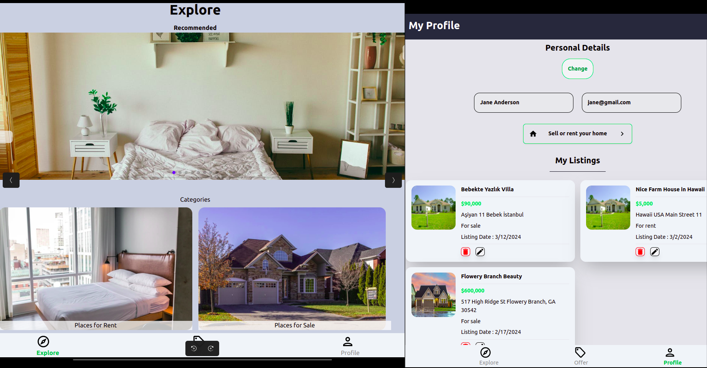
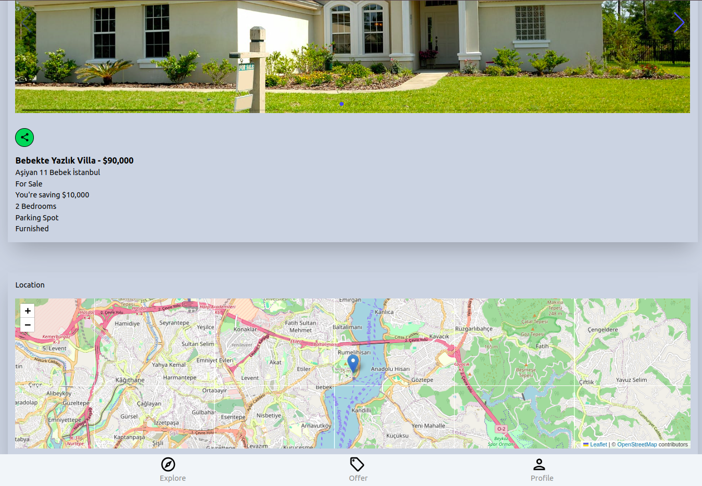

# FireBase + React + TypeScript + Vite + Tailwindcss Responsive House Market App




This project is part of my React portfolio. It is a House Market App that uses Firebase.

## Table of Contents

- [Features](#features)
- [Installation](#installation)
- [Run the Application](#run-the-application)

### Features

<a name="features"></a>

- Easy-to-use and user-friendly interface.
- Clean and intuitive design.
- Responsive layout for mobile and desktop.
- Built with (React, TypeScript.js, Tailwindcss, Firebase)
- Uses Swiper for slides and Leaflet Map for the map.

### Installation

<a name="installation"></a> 3. Install Dependencies:

```bash
npm install
```

### Run the Application

<a name="run-the-application"></a>

```bash

npm run dev

```

5. BUILD & DEPLOY

```bash
# Create frontend prod build
npm run build
```
